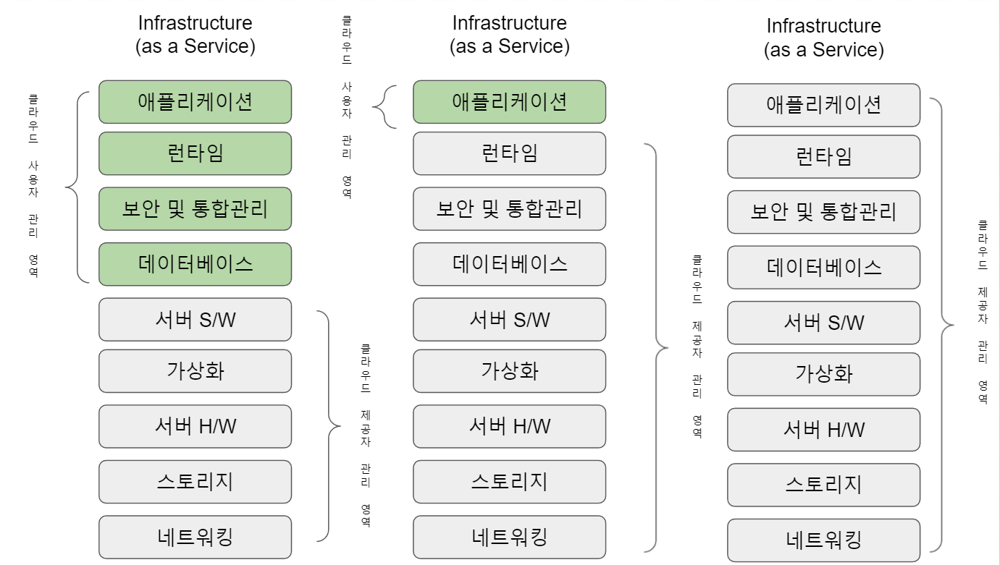
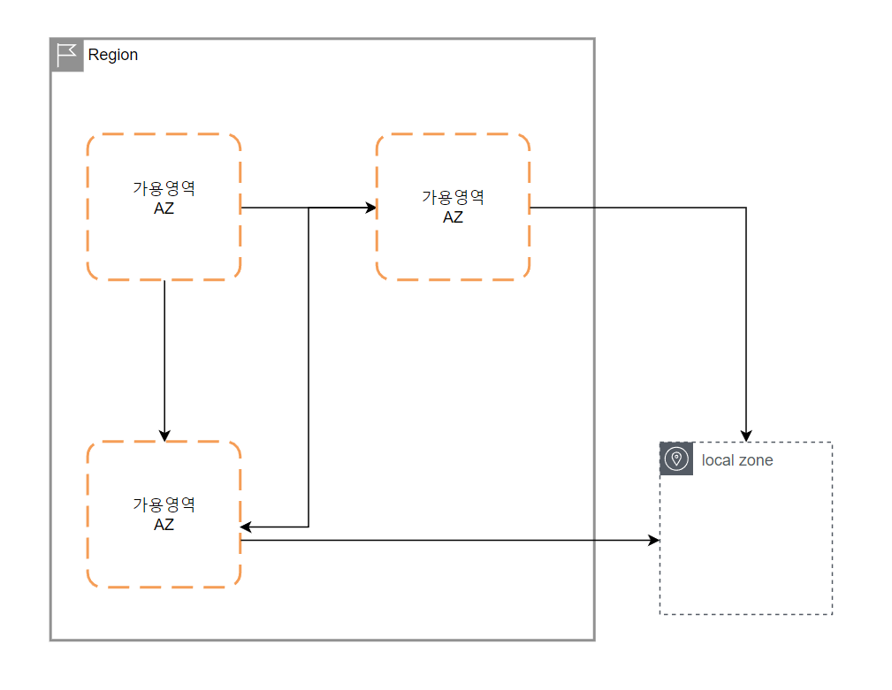
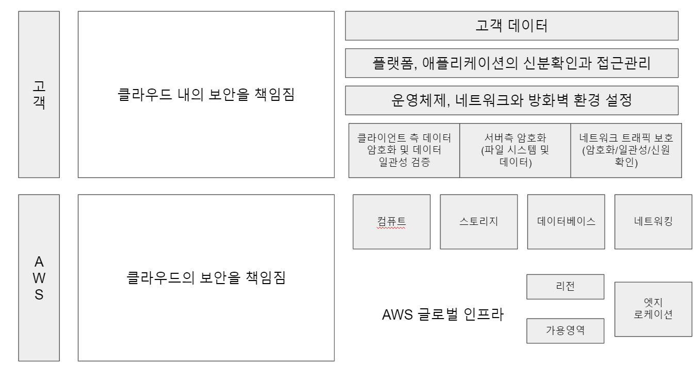

# 클라우드 컴퓨팅과 AWS의 개요

## 클라우드 컴퓨팅의 개요

미국 국립표준기술연구소(NIST)는 클라우드 컴퓨팅을 다음과 같이 정의하고 있습니다.

```
클라우드 컴퓨팅이란 어디서나 접속 가능하고, 편리하며, 온디맨드 방식으로 신속하고 간편하게 검증 및 배포된 공유 컴퓨팅 자원에 접근할 수 있는 컴퓨팅 기술입니다.
```

즉, 인터넷을 통해 온디맨드 방식으로 사용량에 따른 과금 모델을 따르는 IT 자원을 사용할 수 있는 컴퓨팅 기술을 의미합니다.

> 클라우드 컴퓨팅의 3가지 특성

- 온디맨드 : 클라우드 컴퓨팅 기술을 통해 필요에 따라 언제든 접근할 수 있는 IT 인프라를 필요한 만큼 사용할 수 있습니다.

- 인터넷을 통한 자원 접근 : 클라우드에 배포한 모든 자원은 인터넷을 통해 접근 가능하므로 전 세계 어디에서나 해당 자원에 접속해 어떤 자원이든 활용할 수 있습니다.

- 사용량별 과금 모델 : 서비스를 사용한 만큼만 비용이 지불하면 됩니다.

> 클라우드 컴퓨팅을 이용하는 이점

클라우드 컴퓨팅을 이용하면 자체 데이터 센터를 운영하거나 별도의 서버를 구입할 필요가 없어집니다.

필요한 서버, 스토리지, 네트워크, 데이터베이스, 기타 서비스를 사용하고 필요에 따라 이들 자원을 확장하거나 축소하기만 하면 됩니다.

그 덕분에 클라우드 컴퓨팅을 이용하여 인프라 자원의 구매 및 관리에 소요되는 비용과 시간을 아낄 수 있습니다.

## AWS 기반 클라우드 컴퓨팅의 이점

> 민첩성 확보

온프레미스 환경에서 프로젝트를 시작한다고 가정하면 서버나 스토리지 장비 같은 하드웨어들을 확보해야 할 것입니다.

이런 인프라를 구축하는 과정만 하더라도 많은 준비기간이 필요할 것입니다.

하지만 클라우드를 이용하면 원하는 거의 모든 자원들을 즉각적으로 확보할 수 있습니다.

클라우드에서 프로젝트를 시작하면 직접 구축하는 것보다 준비기간이 훨씬 짧고 신속하게 프로젝트를 시작할 수 있습니다.

또한, 프로젝트 중 인프라의 확장이 필요한 시점에서 거의 즉시 원하는 수준으로 확장할 수 있습니다.

> 용량에 대한 걱정 불식

직접 서버를 구축한다면 가장 먼저 서버의 용량을 결정해야 할 것입니다.

서버의 용량을 결정하기 위해서는 사용자의 수, 기간당 데이터 전송의 크기, 적절한 응답속도, 예상되는 서버 요청 성장률, 서비스 합의서(SLA)등 다양한 요소를 근거로 의사결정을 해야합니다.

이러한 의사결정을 하는데 수개월이 소요되기도 하며 또한 일단 구매했다면 데이터 센터에 최소 3년이상 보유해야 투자비용을 회수할 수 있습니다.

그래서 의사결정을 하는 동안 요구 수준이 변경되더라도 하드웨어 스펙을 바꿀 수 없는 상황이 될 수 있습니다.

또한, 평소에는 그렇게 트래픽이 많지않다가 특정 상황에서 트래픽이 폭발적으로 증가하는 서비스(할인 행사 등) 같은 경우 장비의 스펙을 결정하기 굉장히 어려울 것입니다.

클라우드는 트래픽 증대 등 요구수준에 따라 빠르게 인프라를 확장 및 축소할 수 있는 탄력성을 제공하므로 원하는 시점의 수요에 맞춰 클라우드 인프라를 확보할 수 있습니다.

인프라를 빠르게 축소하고 확장할 수 있기 때문에 미사용 자원에 대한 비용 지출을 줄이고 사용자 요구 수준에 항상 적절한 대응이 가능합니다.

> 대규모 자본적 비용에서 소규모 유동 비용으로 전환

하드웨어를 직접 구매하는 경우 즉각적으로 대규모 자본적 비용이 발생하기 마련인데 이는 굉장히 부담스럽습니다.

예를들어, 어떤 비즈니스 실험을 하려고 작은 프로젝트를 하려고 할때 하드웨어를 직접 다 구매해서 구축하려면 비용과 시간이 많이 소요될 것 입니다.

이런 상황에서 클라우드를 사용하면 기업 입장에서 더 많은 비즈니스 실험을 할 수 있고 기업 혁신의 가능성도 커집니다.

> 규모의 경제 달성

코스트코 같은 대형마트에서 제품을 시중가보다 싸게 할인된 가격으로 판매하는 것을 본적 있을 겁니다.

이는 대량으로 구매하고 대량으로 판매하기 때문에 가능한 것인데 클라우드도 마찬가지로 수십 만의 사용자가 몰린 서비스에서 좀 더 저렴한 비용으로 이용할 수 있는 규모의 경제가 나타나며, 저렴한 사용량 별 과금또한 가능해집니다.

> 데이터 센터 구축 비용 절약

클라우드 컴퓨팅을 이용하면 더 이상 대규모 데이터 센터를 구축하지 않아도 됩니다.

데이터 센터를 보유하려면 엄격한 시설기준 준수, 서버 랙 구축, 고압 전력망 구축은 물론 대규모 전용 기간 장기 임대, 운영인력 고용, 물리적 보안 체계 확보 등 굉장히 많은 리스크 요인을 감수해야 합니다.

클라우드 컴퓨팅을 사용하면 이런 리스크를 지지 않아도 되며 비즈니스에 집중할 수 있습니다.

> 기술 혁신성의 유지

AWS는 혁신성을 유지하기 위해 지속적으로 노력하고 있으며 고객은 첨단의 제품 및 기술을 필요에 따라 이용하기만 하면 됩니다.

업계에 새로운 기술이 등장하면 거의 즉각적으로 해당 기술을 활용할 수 있습니다.

> 단기간 내 세계화 가능

만약 모든 인프라를 하나의 데이터 센터에 집중해놨다고 가정해봅시다.

재난 시나리오에 맞춰 또 다른 지역에 복구 인프라를 확보하거나 사업 확장을 위해 다른 국가에 새 데이터 센터를 구축한다고 한다면 많은 시간과 비용이 발생할 것입니다.

하지만 클라우드 컴퓨팅이라면 다른 지역에서 인프라를 운영하기 위해 많은 시간을 기다릴 필요가 없으며 즉각적으로 인프라를 구축할 수 있습니다.

## 클라우드 컴퓨팅의 3대 모델

클라우드 컴퓨팅에는 세가지 모델이 있으며 비즈니스 니즈, 통제성, 관리성 수준에 따라 그중 한가지를 선택하거나 세가지 모두를 선택할 수 있습니다.

클라우드 컴퓨팅의 3대 모델은 서비스로서의 인프라(IaaS), 서비스로서의 플랫폼(PaaS), 서비스로서의 소프트웨어(SaaS)입니다.

> IaaS(Infrastructure-as-a-Service)

IaaS 모델은 컴퓨팅, 네트워킹, 스토리지, 데이터 센터용 공간 등 클라우드 IT 환경 전반을 제공하며, 자체 데이터 센터를 운영하듯 클라우드 인프라를 운영하게 됩니다.

IaaS는 높은 유연성을 제공하며 확보한 모든 자원에 대한 완벽한 통제성을 제공합니다.

IaaS는 클라우드에 나만의 데이터 센터를 구축하는 개념의 모델입니다.

Ex ) AWS EC2

> PaaS(Platform-as-a-Service)

IaaS 모델은 전반적인 인프라를 모두 직접 관리한다는 개념입니다.

관리 업무가 부담스럽게 느껴지고 비즈니스에 필수적인 애플리케이션 배포와 관리에만 집중하고 싶다면 PaaS 모델이 적합합니다.

PaaS 모델에서 AWS와 같은 클라우드 기업이 전반적인 IT 인프라 관리 업무를 전담하므로 인프라 관리, 용량 계획, 소프트웨어 업그레이드 관리 등의 업무는 잊고 비즈니스 니즈에만 집중할 수 있습니다.

Ex ) AWS Lambda

> SaaS(Software-as-a-Service)

SaaS 모델은 PaaS 모델보다 훨씬 간단한데 인터넷을 통해 애플리케이션을 제공하기만 하면 됩니다.

SaaS 제공자는 관련된 모든 서비스 요소를 전적으로 호스팅하고 사용자는 제품을 어떻게 제공할지만 고려하면 됩니다.

서버 소프트웨어의 호스팅 방식과 위치를 몰라도 되고 관리 방식, 업그레이드 주기, 유지보수 기간도 관여할 필요가 없어집니다.

Ex ) Salesforce CRM

다음 그림은 세가지 클라우드 컴퓨팅 모델을 보여주고 사용자와 클라우드 제공자의 관리 영역을 설명합니다.



## 클라우드 컴퓨팅의 3대 배포 모델

> 퍼블릭 클라우드(올 인 클라우드)

AWS와 같은 클라우드 서비스 제공자를 통해 애플리케이션을 배포하는 방식을 퍼블릭 클라우드 또는 올 인 클라우드 라고 부릅니다.

퍼블릭 클라우드의 이용 방식은 크게 두 가지가 있는데, 하나는 클라우드에서 새 애플리케이션을 개발 및 제공하는 방법이고, 다른 하나는 기존의 애플리케이션을 클라우드로 이전하는 방법입니다.

클라우드 기반의 애플리케이션은 로우 레벨 인프라를 조합하는 방식이나 주요 인프라의 관리 기법, 아키텍처, 확장 전략 등을 구현한 하이 레벨 서비스를 이용하는 방식으로 구현할 수 있습니다.

대표적인 사례는 넷플릭스로 모든 데이터 센터와 스트리밍 콘텐츠 서비스를 AWS에서 제공합니다.

오늘날 많은 기업은 퍼블릭 클라우드(올 인 클라우드) 전략을 도입중입니다.

대부분의 스타트업과 새로 시장에 진입한 기업은 퍼블릭 클라우드(올 인 클라우드) 전략으로만 인프라를 운영 관리합니다.

> 하이브리드 클라우드

애플리케이션 중 일부는 퍼블릭 클라우드에서, 나머지는 온프레미스 환경에서 제공하는 방식입니다.

이들 두 가지 환경을 긴밀하게 연결하면 기존 데이터 센터의 확장 개념에서 퍼블릭 클라우드를 이용할 수 있고 클라우드 전환을 위한 가장 신속한 방법이기도 합니다.

현대 기업 대부분은 이미 데이터 센터에 방대한 인프라와 데이터를 축적해 뒀기 때문에 이를 일시에 클라우드로 이전하기는 어렵습니다.

이 때 하이브리드 클라우드 전략을 이용하면 새로 출시할 애플리케이션은 클라우드에 구현하거나 기존의 IT 시스템을 일정 기간 동안 클라우드로 이전할 수 있습니다.

AWS 등 클라우드 사업자는 퍼블릭은 물론 하이브리드 클라우드 모델도 지원합니다.

> 온프레미스 또는 프라이빗 클라우드

가상화나 자원 관리도구를 이용해 자체 데이터 센터에 애플리케이션을 배포하는 경우를 가리킵니다.

일부 현대적인 클라우드 아키텍처를 구현할 수는 있으나 첨단의 퍼블릭 클라우드 기술 중 일부는 구현하기 어려운 형태입니다.

기업에 속한 자회사 또는 개별 부서는 프라이빗 클라우드를 통해 기업의 보안 자원에 접속하고 사용량에 따른 비용을 내부 데이터 센터에 지불합니다.

일반적인 기업이라면 온프레미스에서 프라이빗 클라우드로 전환하면서 기존의 비가상화 서버를 가상화 서버로 변경해 자동화 및 과금 일원화 목표를 달성합니다.

가상화 기법을 이용하면 프로젝트 단위로 서버를 마련한 필요 없이 컴퓨트 노드만 할당하면 되는데 대표적인 사례로는 솔라리스의 존/컨테이너, IBM의 서버 파티셔닝, VMWare ESX등이 있습니다.

프라이빗 클라우드는 프로비저닝, 서버 작동/중지/용량 조절, 과금과 같은 셀프 서비스 기능을 가상화 기술로 구현한 것이라 할 수 있습니다.

## AWS 태동과 발전

아마존은 혁신적인 아이콘이라 할 수 있습니다.

AWS의 신규 제품과 서비스 개발 속도는 미처 따라가기 힘들정도로 빠르다는 느김을 줍니다.

아마존 기업문화에서 가장 돋보이는 것은 실험 정신이라 할 수 있습니다.

아마존이 모든 도전에서 성공한 것은 아니지만 상당수의 도전이 치열한 경쟁을 뚫고 성공에 이르렀습니다.

AWS의 실험 정신이 현대 클라우드 컴퓨팅 기술 경쟁에서 상대를 압도하는 비법이라 할 수 있습니다.

초기 아마존은 자체 애플리케이션의 운영과 프로비저닝을 위해 인프라를 자동화하기 시작했습니다.

하지만 이내 대규모 확장 기술과 데이터 센터 기술을 융합해 서비스로 제공하는 것이 새로운 시대를 여는 핵심 경쟁력임을 깨닫게 됐습니다.

아마존은 남는 컴퓨팅 자원을 서비스화해 제공함으로써 현대적이고 세련되며 확장성 높은 애플리케이션을 만들 수 있는 AWS의 초기 모델을 만들어 2006년에 공식 출범했습니다.

광범위한 기술 영역에서 175개 이상의 클라우드 제품 및 서비스를 제공하는 AWS는 글로벌 리서치/컨설팅 기관인 가트너로 부터 9년 연속 우수 기업으로 선정되었습니다.

## AWS 글로벌 인프라

AWS는 190여 개 국가에서 100만명 이상의 고객을 확보하고 있으며 리전, 가용영역(AZ), 엣지로케이션(POP) 등으로 구성된 글로벌 클라우드 인프라를 지속적으로 확장하고 있습니다.

- 리전
이들 고객에게 안정적인 서비스를 제공하기 위해 AWS는 25개의 리전이 존재합니다.

리전은 AWS의 클라우드 서비스용 데이터 센터 클러스터가 위치한 물리적인 장소이며, 지리적으로 분산돼 데이터에 대한 국가별 정책을 준수하는 데도 기여합니다.

한 마디로 `리전은 AWS 서비스가 제공되는 지리적 위치`를 나타냅니다.

```
리전에 속한 데이터는 AWS 고객의 명시적인 동의 없이 리전 외부로 이동할 수 없습니다.
```

AWS를 사용하려면 먼저 해당 서비스를 호스팅하게 될 리전을 선택해야 하며, 필요에 따라 데이터가 저장될 리전을 여러 개 선택할 수 있습니다.

AWS는 미국에서 GovCloud 리전을 운영 중이며, 이는 미국 행정부의 애플리케이션 제공을 위해 만들어졌지만 다른 일반 사용자도 해당 리전을 이용할 수 있습니다.

- 가용영역

각 리전에는 AZ라 부르는 가용영역이 존재합니다.

하나의 AZ는 한 개에서 여섯 개의 데이터 센터로 구성되며 전력 공급망과 네트워크망이 중첩적으로 구현됩니다.

작성시점 기준 현재 81개의 가용영역이 존재하며, 각각의 가용영역은 서로 다른 위치에 존재합니다.

전력망 또는 해당 지역에 자연재해 등에 영향받지 않도록 가용영역 별로 분산되도록 설계합니다.

또한 복수의 전력공급원을 통해 중첩적인 전력망을 구성하고 정전 대비용 발전기를 갖추고 있어 하나의 가용영역에 문제가 생기더라도 인접한 다른 가용영역에 동일한 피해가 가지 않도록 합니다.

동일 리전의 가용영역은 저비용성, 고응답성, 고보안성의 조건을 충족하는 광케이블 네트워크로 연결합니다.

동일 리전 내 AZ간의 응답성은 매우 높은 수준이며 동기적으로 가용영역 간에 데이터 복제 인스턴스를 생성할 수 있습니다.

고응답성의 효과는 클라우드 사용자가 다수의 가용영역에서 작동하는 애플리케이션을 디자인할 때 크게 나타나며, 특정 가용영역이 자연재해 등으로 멈춘 경우에도 애플리케이션 작동에는 문제가 없게 됩니다.

또 하나의 가용영역이 문제가 생겼을 경우 자동으로 다른 가용영역으로 가동되는 아키텍처를 구성할 수도 있습니다.

- 로컬 존

AWS는 기존의 AZ 외에도 사용자는 많지만 리전이 없는 지역에 Local Zones(로컬 존)을 추가해 서비스를 제공합니다.

로컬 존은 인근 리전과 초고속 보안 네트워크로 연결돼 기존에는 접속할 수 없었던 AWS의 다양한 서비스를 활용할 수 있도록 지원합니다.

원래 로컬 존은 기존의 AWS 리전을 보조하기 위해 설계됐으며, 다음 그림은 로컬 존과 AWS 리전 내에 AZ와의 관계를 보여줍니다.



AWS 데이터 센터는 항상 가동되고 있으며 전 세계 사용자가 늘 접속해 있는 상태입니다.

각각의 데이터 센터에는 수천대의 서버가 가동 중이며 각 서버는 보안 수준과 회선 속도에 따라 커스터 마이징 된 네트워크를 통해 고객에게 서비스를 제공합니다.

- 엣지 로케이션(POP)

AWS는 리전과 AZ외에도 엣지 로케이션 또는 POP이라 부르는 접속 지점을 통해 고객에게 더 나은 사용자 경험을 제공합니다.

엣지 로케이션은 전 세계 주요 도시에 위치하며 현재 218개 이상의 POP이 존재합니다.

엣지 로케이션은 주로 CDN, 즉 콘텐츠 배포 네트워크로 사용되며 인근 사용자에게 고성능의 서비스를 제공할수 있게 합니다.

예를 들어, 아마존 비디오를 시청하는 경우 엣지 로케이션에 해당 비디오 데이터를 캐시해 다른 지역 고객이 동일한 비디오를 시청할 때 지연과 끊김이 없는 고품질의 영상 서비스를 제공할 수 있습니다.

AWS에서 엣지 로케이션은 Amazon CloudFront 서비스와 Amazone Route 53 서비스를 제공하는데 활용됩니다.

- 리전별 엣지 캐시 로케이션

최근 AWS는 엣지 로케이션 외에 메인서버와 엣지 로케이션 사이에 리전별 엣지 로케이션을 추가하고 있습니다.

특정 객체에 일정 시간 이상 접속할 수 없는 경우 캐시의 도움을 받을 수 없지만 리전별 엣지 캐시는 대규모의 캐시를 유지하므로 객체는 훨씬 오랫동안 캐시 데이터를 저장해 둘 수 있습니다.

이를 통해 애플리케이션이 해당 객체에 다시 접속할 때 접근 권한을 요청하고자 다시 메인서버로 이동해야 하는 불편함이 줄어들며, 접속 빈도가 낮은 객체의 성능을 높여주는 효과가 있습니다.

즉, 하나의 POP은 엣지 로케이션과 리전별 엣지 캐시로 구성 됩니다.

## AWS 보안과 준수해야할 원칙

AWS는 공유 보안 모델을 따르고 있는데 이는 클라우드 자체의 보안은 AWS가 맡고 클라우드 내의 보안은 고객이 맡는 다는 의미입니다.

즉, AWS는 데이터 센터, 비디오 감시, 하드웨어, 서버, 스토리지, 가상화 자원, 네트워킹 등 물리적 보안을 책임지고 고객은 애플리케이션과 호스팅하는 데이터에 대한 보안을 책임집니다.

Amazon RDS, Amazon RedShift, Amazon DynamoDB등 관리형 서비스의 경우, AWS가 보안 환경 설정에 대한 책임도 지게 됩니다.

다음 그림은 AWS의 공유 보안 모델을 나타냅니다.



이 모델은 고객은 자신의 애플리케이션에 요구되는 수준의 보안을 선택하면 되므로 애플리케이션과 데이터 보안에 유연하게 대처할 수 있습니다.

고객은 공유 보안 모델을 통해 자체 데이터 센터를 운영할 대 지게 되는 책임과 유사한 수준의 책임을 부담합니다.

AWS는 고객이 클라우드 내에서 자신의 데이터가 안전하게 보호되고 있음을 알 수 있도록 다양한 산업영역에서 각종 보안인증을 획득했습니다.
